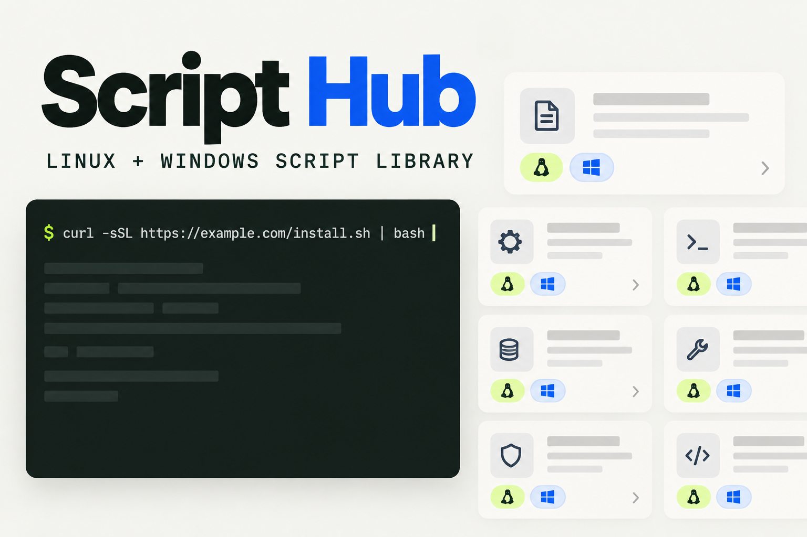

# Script Hub

[](https://github.com/snail468/script-hub/actions/workflows/docker-publish.yml)
[](https://github.com/snail468/script-hub/actions/workflows/cloudflare-deploy.yml)



一个面向 Linux / Windows 的自托管脚本库：收藏外部脚本、在线编辑、上传文本脚本，并一键复制运行命令。

项目仓库：[github.com/snail468/script-hub](https://github.com/snail468/script-hub)

项目采用 React + Hono，共用一套 API，针对两种部署环境提供不同的持久化实现：

| 部署方式 | 运行时 | 数据存储 | 适用场景 |
| --- | --- | --- | --- |
| Docker / GHCR | Node.js 22 | SQLite 数据卷 | NAS、VPS、内网服务器 |
| Cloudflare Workers | Workers | D1 | 公网访问、免服务器维护 |

## 功能

- Linux、Windows、跨平台脚本分类
- Bash、PowerShell、CMD、Python 等运行环境筛选
- 在线创建、编辑、删除与下载脚本
- 上传 `.sh`、`.ps1`、`.cmd`、`.bat`、`.py`、`.txt` 文件
- 从 GitHub、Gist、GitLab、Bitbucket 收藏外部脚本快照
- 一键复制 Bash / PowerShell / CMD / Python 运行命令
- 搜索、标签、响应式界面与键盘可访问弹窗
- 可选 `ADMIN_TOKEN` 写保护
- 服务端限制上传体积、导入域名、跳转次数与抓取超时
- GitHub Actions 自动构建 `linux/amd64`、`linux/arm64` GHCR 镜像
- GitHub Actions / 本地命令一键创建 D1、迁移并发布 Workers

> [!WARNING]
> 一键命令会执行脚本。运行前务必查看脚本内容；公网部署必须设置高强度 `ADMIN_TOKEN`。

## 本地开发

要求 Node.js `>= 22.13`，推荐使用项目锁定的 pnpm 版本。

```bash
git clone git@github.com:snail468/script-hub.git
cd script-hub
corepack enable
corepack prepare pnpm@11.19.0 --activate
pnpm install
cp .env.example .env
pnpm dev
```

Windows PowerShell 复制环境文件：

```powershell
Copy-Item .env.example .env
pnpm dev
```

- 前端开发地址：`http://localhost:5173`
- Node API 地址：`http://localhost:8787`
- 本地数据库：`./data/script-hub.db`

提交前执行：

```bash
pnpm run check
pnpm test
pnpm run build
```

## Docker 一键部署

### 使用 GitHub 预构建镜像

Fork 本项目后，GitHub Actions 会在推送到 `main` 或创建 `v*` 标签时构建多架构镜像：

```text
ghcr.io/snail468/script-hub:latest
```

首次发布后，请在 GitHub 仓库的 `Packages → Package settings` 中将镜像设为 Public；若保持私有，服务器需要先执行 `docker login ghcr.io`。

在服务器创建部署目录，下载 `docker-compose.yml` 和 `.env.example`，然后：

```bash
cp .env.example .env
```

编辑 `.env`，至少修改以下两项：

```dotenv
SCRIPT_HUB_IMAGE=ghcr.io/snail468/script-hub:latest
ADMIN_TOKEN=<至少 32 字节的随机字符串>
```

可以生成随机令牌：

```bash
openssl rand -hex 32
```

启动：

```bash
docker compose pull
docker compose up -d
docker compose ps
```

默认访问地址为 `http://服务器IP:3000`。生产环境建议使用 Caddy、Nginx 或 Traefik 提供 HTTPS，并让容器端口只监听回环地址；例如将 Compose 端口改为：

```yaml
ports:
  - "127.0.0.1:3000:3000"
```

### 本地构建镜像

```bash
docker build -t script-hub:local .
docker run -d \
  --name script-hub \
  --restart unless-stopped \
  -p 3000:3000 \
  -e ADMIN_TOKEN="$(openssl rand -hex 32)" \
  -v script-hub-data:/data \
  --read-only \
  --tmpfs /tmp:rw,noexec,nosuid,size=16m \
  --cap-drop ALL \
  --security-opt no-new-privileges \
  script-hub:local
```

容器以非 root 用户运行，根文件系统只读，只有 `/data` 数据卷可写。

### 更新与备份

更新镜像：

```bash
docker compose pull
docker compose up -d
```

一致性备份建议短暂停止容器后打包数据卷：

```bash
docker compose stop
docker run --rm -v script-hub-data:/data -v "$PWD":/backup alpine \
  tar czf /backup/script-hub-data.tar.gz -C /data .
docker compose start
```

恢复前请停止容器，并先保留现有数据卷副本。

## Cloudflare Workers 一键部署

Workers 使用 D1 保存脚本，不需要 R2。部署脚本会自动：

1. 查找或创建名为 `script-hub` 的 D1 数据库；
2. 生成不提交到 Git 的临时 Wrangler 配置；
3. 应用 `migrations/` 中尚未执行的迁移；
4. 构建前端并部署 Worker；
5. 如提供 `ADMIN_TOKEN`，将其写入 Cloudflare Secret。

### 方式一：GitHub Actions

Fork 后，在仓库 `Settings → Secrets and variables → Actions` 中添加：

| 类型 | 名称 | 说明 |
| --- | --- | --- |
| Secret | `CLOUDFLARE_API_TOKEN` | Cloudflare API Token |
| Secret | `CLOUDFLARE_ACCOUNT_ID` | Cloudflare Account ID |
| Secret | `ADMIN_TOKEN` | 管理员写入令牌 |
| Variable（可选） | `CLOUDFLARE_WORKER_NAME` | 默认 `script-hub` |
| Variable（可选） | `CLOUDFLARE_D1_NAME` | 默认 `script-hub` |

API Token 至少需要 Workers Scripts 与 D1 的编辑权限。随后打开 `Actions → Validate and deploy to Cloudflare Workers → Run workflow` 完成一键发布。推送相关代码到 `main` 时只执行校验，不会在未确认的情况下改动生产环境。

### 方式二：本地 CLI

先登录 Cloudflare：

```bash
pnpm exec wrangler login
```

或为 CI 设置环境变量：

```bash
export CLOUDFLARE_ACCOUNT_ID="你的账号 ID"
export CLOUDFLARE_API_TOKEN="你的 API Token"
export ADMIN_TOKEN="$(openssl rand -hex 32)"
pnpm run cf:deploy
```

PowerShell：

```powershell
$env:CLOUDFLARE_ACCOUNT_ID = "你的账号 ID"
$env:CLOUDFLARE_API_TOKEN = "你的 API Token"
$env:ADMIN_TOKEN = -join ((48..57) + (97..102) | Get-Random -Count 64 | ForEach-Object {[char]$_})
pnpm run cf:deploy
```

本地模拟 Workers：

```bash
cp .dev.vars.example .dev.vars
pnpm run cf:dev
```

D1 备份示例：

```bash
pnpm exec wrangler d1 export script-hub --remote --output backup.sql
```

Cloudflare 配置依据官方的 [Workers 静态资源 SPA 路由](https://developers.cloudflare.com/workers/static-assets/routing/single-page-application/)、[D1 migrations](https://developers.cloudflare.com/d1/reference/migrations/) 和 [Secrets](https://developers.cloudflare.com/workers/configuration/secrets/) 机制。

## 配置项

| 变量 | 默认值 | 说明 |
| --- | --- | --- |
| `ADMIN_TOKEN` | 空 | 写操作令牌；生产必须设置 |
| `DB_PATH` | `./data/script-hub.db` | Docker / Node SQLite 路径 |
| `PORT` | `8787`（容器为 `3000`） | Node 服务端口 |
| `HOST` | `127.0.0.1`（容器为 `0.0.0.0`） | Node 监听地址 |
| `MAX_SCRIPT_BYTES` | `262144` | 单脚本限制，服务端最高允许 1 MiB |
| `IMPORT_HOSTS` | 常用代码托管域名 | 允许服务端抓取的 HTTPS 域名，逗号分隔 |

不要在生产环境把 `IMPORT_HOSTS` 设置为 `*`，否则会扩大服务端请求伪造（SSRF）风险。

## 目录结构

```text
src/                    React 前端
server/api.ts           公共 API、校验与安全策略
server/node.ts          Docker / Node 入口
server/node-store.ts    SQLite 存储
server/worker.ts        Cloudflare Worker 入口
server/d1-store.ts      D1 存储
migrations/             D1 迁移
scripts/                自动部署脚本
.github/workflows/      Docker 与 Workers 发布流程
```

## 实施建议与后续路线

当前版本适合个人或小团队自托管。按价值和风险排序，建议后续这样演进：

1. **先加版本历史与回滚**：每次保存时记录内容版本、修改人和校验值，避免误改生产脚本。
2. **再做团队权限**：接入 OIDC / Cloudflare Access，区分只读、编辑、管理员，替代共享令牌。
3. **增加安全扫描**：保存前接入 ShellCheck、PSScriptAnalyzer；危险命令只提示，不自动执行。
4. **加审计与签名**：记录导入来源、SHA-256、执行命令复制事件；发布脚本可增加签名验证。
5. **完善导入适配**：支持 GitHub 仓库目录同步、定时检查上游变更，但更新必须人工确认。
6. **暂缓在线执行**：浏览器端远程执行会引入主机凭据和命令注入风险，建议维持“复制命令、用户确认执行”的边界。

## 安全说明

- 脚本展示使用纯文本，不执行用户提交的 HTML。
- 写接口使用 Bearer Token；令牌只保存在浏览器 `sessionStorage`。
- 外部收藏只允许 HTTPS，逐次校验重定向域名，并限制 10 秒与文件大小。
- Docker 使用非 root 用户、只读根文件系统、移除 Linux capabilities。
- Cloudflare Secret 和 GitHub Secret 不应写入仓库、镜像或 Wrangler 明文变量。
- 本项目不会在服务端自动运行保存的脚本。

## License

MIT
